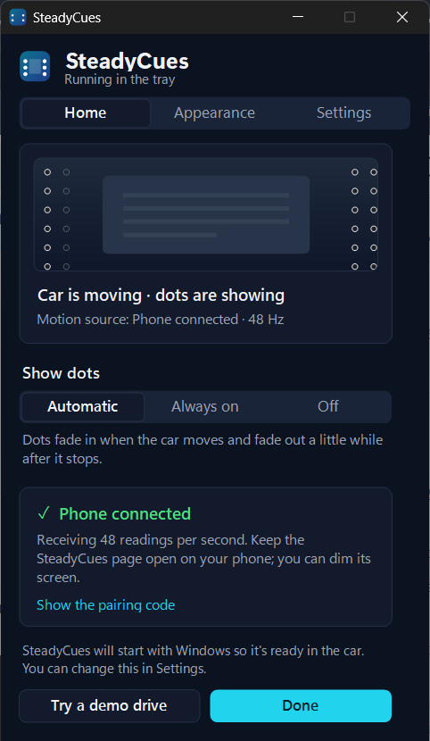
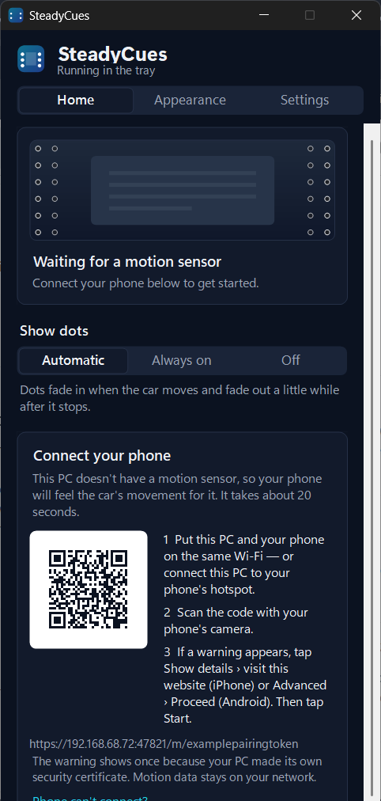

<div align="center">


# SteadyCues

**Vehicle motion cues for Windows.** Softly moving dots at the edges of your screen follow the car,
so what you see agrees with what you feel, and reading on the road is easier.

[**Download for Windows**](https://github.com/Aweswomedude1234/motion-cues/releases/latest/download/SteadyCues.exe)
&nbsp;·&nbsp; [Website](https://aweswomedude1234.github.io/motion-cues/)
&nbsp;·&nbsp; [Releases](https://github.com/Aweswomedude1234/motion-cues/releases)
&nbsp;·&nbsp; [Report a problem](https://github.com/Aweswomedude1234/motion-cues/issues)

[](https://github.com/Aweswomedude1234/motion-cues/actions/workflows/ci.yml)
[](LICENSE)



&nbsp;


</div>

## What it does

Car sickness is thought to come from a mismatch: your inner ear feels the car speed up, brake and
turn, while your eyes, fixed on a still screen, see nothing move. SteadyCues shows that motion at
the edges of your view, like Vehicle Motion Cues on iPhone:

| The car… | You feel pushed… | The dots move… |
| --- | --- | --- |
| speeds up | back into your seat | down |
| brakes | forward | up |
| turns left | to the right | right |
| turns right | to the left | left |

The dots are click-through, stay on top of every app, fade in when the car moves (Automatic mode)
and don't show up in screenshots or screen sharing.

> SteadyCues helps many people but isn't a medical treatment, and it is for passengers only.

## Get started

1. **[Download SteadyCues.exe](https://github.com/Aweswomedude1234/motion-cues/releases/latest/download/SteadyCues.exe)** and open it.
   It installs itself for your account (no admin rights) and adds a Start menu entry.
   If Windows says the publisher is unknown, choose **More info → Run anyway**.
2. **Tablet or 2-in-1?** SteadyCues finds its motion sensor automatically. You're done.
3. **Laptop without a sensor?** Use your phone: connect both to the same Wi-Fi, or connect the PC
   to your phone's hotspot. Scan the QR code shown in SteadyCues, confirm the one-time security
   notice, and tap **Start**. Lay the phone flat with its top toward the front of the car, or use
   a phone mount.

Press **Ctrl + Alt + M** at any time to hide or show the dots.

### Motion sources

| Source | Where it comes from | Notes |
| --- | --- | --- |
| This PC | Accelerometer + gyroscope via the Windows Sensor API | Most tablets and 2-in-1s |
| Phone | Any iPhone or Android browser, over your local network | Nothing to install; HTTPS page served by your PC |
| GPS | Built-in GNSS, LTE modems, USB GPS receivers | ~1 update/second, so cues are gentler |
| Demo drive | Scripted drive | Preview and tune the dots at your desk |

## Privacy

No account, no analytics, no update pings: SteadyCues never connects to the internet. When the
phone link is on, your phone talks only to your PC over your own network, using a random pairing
link and a certificate generated on your PC. See [SECURITY.md](SECURITY.md).

## How it works

```
 sensor ──► gravity tracking ──► vehicle frame ──► felt force ──► spring model ──► dots
 (PC, phone,  (slow low-pass,     (forward from      (−acceleration)   (smooth, soft-    (layered windows,
  GPS)         gyro-assisted)      how it's held)                        limited)          DwmFlush-paced)
```

- **Gravity and orientation** ([Motion.cs](src/SteadyCues/Motion.cs)). A slow low-pass filter
  finds "down". Forward is inferred from how the device is held: an upright screen (laptop lid,
  dashboard mount) has its back facing forward, a flat device points forward with its top edge.
  When a gyroscope reports rotation about a horizontal axis, someone is moving the device, not the
  car, so the cues hold still and gravity re-converges immediately. That lets gravity be tracked
  slowly enough that long accelerations and bends stay visible.
- **Overlay** ([Overlay.cs](src/SteadyCues/Overlay.cs)). One click-through, topmost
  `WS_EX_LAYERED` window per screen edge, drawn with GDI+ into a DIB and presented with
  `UpdateLayeredWindow`, paced by `DwmFlush` so motion is locked to the display refresh. The dots
  are an infinite lattice displaced by a critically damped spring, so they never run out. It
  redraws only when something changes and sleeps while the dots are hidden.
- **Phone link** ([PhoneBridge.cs](src/SteadyCues/Sources/PhoneBridge.cs),
  [phone.html](src/SteadyCues/Assets/phone.html)). Browsers only expose motion sensors to secure
  pages, so the PC serves a small HTTPS page with a self-signed certificate (kept encrypted with
  DPAPI so the phone only confirms it once). The phone normalizes sign conventions across browsers
  and streams samples with its gyroscope rate about 20 times a second.
- **Install** ([Installer.cs](src/SteadyCues/Installer.cs)). The downloaded exe copies itself to
  `%LOCALAPPDATA%\Programs\SteadyCues`, registers in Settings › Apps and relaunches. Running a
  newer download replaces the older version. `--portable` skips all of this.

## Build from source

Everything builds with what ships with Windows 10/11: SteadyCues targets .NET Framework 4.8 and
uses its built-in C# compiler. No SDK, no Visual Studio, no NuGet.

```powershell
git clone https://github.com/Aweswomedude1234/motion-cues
cd motion-cues
.\build.ps1          # → dist\SteadyCues.exe (~360 KB)
.\test.ps1           # motion, QR and settings tests
```

The website (`website/`) is built with [Astryx](https://github.com/facebook/astryx), React and
Vite. See [CONTRIBUTING.md](CONTRIBUTING.md).

```
src/SteadyCues/
  Program.cs            entry point, single instance, install hand-off
  TrayApp.cs            tray icon, hotkey, wiring
  Motion.cs             vector math, device → vehicle frame, source selection
  Overlay.cs            the dots
  Sources/              built-in sensor, phone link, GPS, demo drive
  UI/                   settings window and owner-drawn controls
  QrCode.cs             QR encoder for the pairing link
  Assets/phone.html     the page your phone opens
tests/Tests.cs          test suite
website/                project website (Astryx + React + Vite)
```

## Acknowledgements

- Inspired by Vehicle Motion Cues on iPhone. SteadyCues is independent and not affiliated with
  Apple or Microsoft.
- The QR encoder follows the structure of [Project Nayuki's QR Code generator](https://www.nayuki.io/page/qr-code-generator-library) (MIT).
- Website built with the [Astryx design system](https://github.com/facebook/astryx) (MIT).

## License

[MIT](LICENSE)
