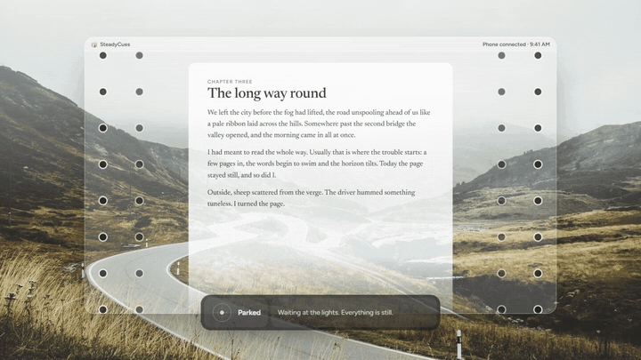

# SteadyCues press kit

Everything you need to write about SteadyCues. All assets may be used freely in coverage.

## In one sentence

SteadyCues is a free, open-source Windows app that helps passengers read without getting car
sick: softly moving dots at the edges of the screen follow the car's motion, like Vehicle
Motion Cues on iPhone.

## Short description (50 words)

SteadyCues brings motion cues to Windows. Dots at the edges of your screen move with the car,
so what your eyes see matches what your inner ear feels. Laptops without a motion sensor can
use a phone: scan a QR code and tap Start. It's free, open source, 355 KB and fully private.

## Fact sheet

| | |
| --- | --- |
| Platform | Windows 10 and 11 |
| Price | Free (MIT license) |
| Size | 355 KB, single exe, no admin rights needed |
| Motion sources | PC accelerometer and gyroscope (tablets, 2-in-1s), any phone over Wi-Fi or hotspot, GPS |
| Privacy | No account, no internet access, no analytics; the phone talks only to your PC |
| Website | https://steadycues.vercel.app |
| Download | https://github.com/Aweswomedude1234/motion-cues/releases/latest |
| Source | https://github.com/Aweswomedude1234/motion-cues |

## Assets

| Asset | File |
| --- | --- |
| Demo video, 16:9 (44 s) | https://steadycues.vercel.app/media/steadycues-demo.mp4 |
| Demo video, 9:16 (44 s) | https://steadycues.vercel.app/media/steadycues-demo-vertical.mp4 |
| Demo GIF | [`steadycues-demo.gif`](steadycues-demo.gif) |
| Share image, 1280×640 | [`social-preview.png`](social-preview.png) |
| App icon, 256 px | [`../website/public/icon-256.png`](../website/public/icon-256.png) |
| Screenshots | [`../website/public/screenshot-home.png`](../website/public/screenshot-home.png), [`screenshot-pair.png`](../website/public/screenshot-pair.png), [`screenshot-appearance.png`](../website/public/screenshot-appearance.png) |

Photograph in the video and share images: Fritz Bielmeier on Unsplash.

## Notes for accuracy

- SteadyCues is for passengers only.
- It's inspired by Apple's Vehicle Motion Cues but is independent and not affiliated with
  Apple or Microsoft.
- It isn't a medical device; motion cues help many people but not everyone.

Questions: open an issue at https://github.com/Aweswomedude1234/motion-cues/issues or start a
discussion at https://github.com/Aweswomedude1234/motion-cues/discussions.
